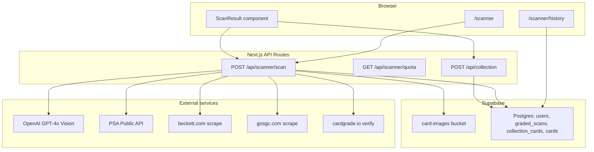

# Collectors Toolkit

A Next.js app for trading card collectors: scan graded slabs (PSA, BGS, SGC), verify cert numbers, review scan history, and save cards to a personal collection. Built for the DBS collectors workflow with Clerk auth, Supabase persistence, and OpenAI vision for slab label OCR.

---

## Table of contents

- [Features](#features)
- [Architecture](#architecture)
- [Tech stack](#tech-stack)
- [Scanner flow](#scanner-flow)
- [Cert lookup](#cert-lookup)
- [API reference](#api-reference)
- [Database](#database)
- [Project structure](#project-structure)
- [Getting started](#getting-started)
- [Environment variables](#environment-variables)
- [Development](#development)
- [Testing](#testing)
- [Deployment](#deployment)
- [Roadmap](#roadmap)
- [License](#license)

---

## Features

### Graded card scanner (implemented)

| Capability | Details |
|------------|---------|
| **Slab photo upload** | Drag-and-drop or camera via `ImageUpload`; images stored in Supabase `card-images` |
| **Label OCR** | OpenAI GPT-4o (Responses API) reads cert number + grading company (PSA / BGS / SGC / CGC) |
| **Cert verification** | PSA Public API; BGS and SGC via respectful HTML scraping; CardGrade.io as fallback |
| **Global cert cache** | Reuses successful lookups from any prior `graded_scans` row (same cert + grader) |
| **Scan history** | `/scanner/history` lists all scans; `/scanner/history/[scanId]` reopens a scan |
| **Save to collection** | Optional purchase metadata; idempotent save per `scan_id` |
| **Rate limiting** | 50 scans per user per day (`usage_logs` table) |

### Collection (partial)

| Capability | Status |
|------------|--------|
| Save graded card from scan | **Done** — `POST /api/collection` |
| Collection grid / list UI | **Stub** — `/collection` placeholder page |
| Edit / delete collection cards | **Not built** |

### Other modules (planned / stub)

| Module | Route | Status |
|--------|-------|--------|
| Raw card AI grader | `/grader` | Stub UI |
| Portfolio | `/portfolio` | Stub UI |
| Import (eBay CSV, etc.) | `/import` | Stub UI |

---

## Architecture



**Auth model:** [Clerk](https://clerk.com) handles sign-in; API routes call `auth()` and map Clerk users to internal `users` rows via `getOrCreateUserId()`. Database access uses the Supabase **service role** on the server (RLS not enabled yet).

**Page protection:** `middleware.ts` redirects unauthenticated users away from `/scanner`, `/collection`, `/grader`, `/portfolio`, and `/import`. API routes enforce auth independently (no redirect).

---

## Tech stack

| Layer | Technology |
|-------|------------|
| Framework | [Next.js 15](https://nextjs.org) App Router, React 19, TypeScript |
| Styling | Tailwind CSS 3 |
| Auth | Clerk (`@clerk/nextjs`) |
| Database & storage | Supabase (Postgres + Storage) |
| Slab OCR | OpenAI Responses API (`gpt-4o`, strict JSON schema) |
| PSA lookup | PSA Public API (`api.psacard.com`) |
| Icons | Lucide React |

---

## Scanner flow

1. **Upload** — User submits a slab image (or retries with manual cert + grader).
2. **Persist image** — File uploaded to `card-images/{userId}/{timestamp}-{uuid}.jpg`; if storage upload fails, OCR still runs from an inline data URL but no non-durable image URL is persisted.
3. **OCR** — `readSlabLabel()` extracts `certNumber` and `gradingCompany` (minimal schema: two fields only).
4. **Insert scan row** — Every attempt is written to `graded_scans` for history.
5. **Cert lookup** — If cert is plausible and grader is not CGC-only:
   - Check global cache in `graded_scans`
   - Route to PSA API / BGS scrape / SGC scrape
   - On failure, try CardGrade.io verify page
6. **Catalog sync** — `findOrCreateCard()` upserts into `cards` on success.
7. **Response** — `ScannerResult` JSON to the client (includes `savedToCollection` if already linked).
8. **Save (optional)** — User opens overlay → `POST /api/collection` with purchase fields.

**Manual retry:** `ScanResult` sends `manualCertNumber` + `manualGradingCompany` + existing stored `imageUrl` without re-uploading the photo.

---

## Cert lookup

Implementation lives in `src/lib/cert-lookup/`.

| Grader | Method | `lookup_source` value |
|--------|--------|------------------------|
| PSA | Official API (`PSA_API_TOKEN`) | `psa_api` |
| BGS | POST `beckett.com/grading/card-lookup` | `beckett_scrape` |
| SGC | POST `gosgc.com/cert-code-lookup` | `sgc_scrape` |
| Fallback | GET `cardgrade.io/verify/{cert}` | `cardgrade_io` |
| OCR only / failed | — | `ocr` or `failed` |

**Scraper etiquette:** 2-second delay before each outbound scrape; browser-like `User-Agent`.

**Cache:** Before any external call, `getCachedCertLookup()` returns the newest successful row with matching `(cert_number, grading_company)`.

**CGC:** Detected by OCR but cert lookup is not implemented; user can still save manually after entering details.

**Unified entry point:**

```ts
import { lookupCert, lookupCertWithStatus } from '@/lib/cert-lookup';

const result = await lookupCert('12345678', 'BGS');
```

---

## API reference

All API routes use `export const runtime = 'nodejs'` and `export const maxDuration = 60`.

### `POST /api/scanner/scan`

Multipart form data.

| Field | Required | Description |
|-------|----------|-------------|
| `image` | One of image or manual cert | Slab photo file |
| `manualCertNumber` | One of image or manual cert | Digits-only cert (normalized server-side) |
| `manualGradingCompany` | No | `PSA`, `BGS`, `SGC`, or `CGC` (retry flow) |
| `imageUrl` | No | Existing image URL when retrying without re-upload |

**Response:** `ScannerResult` + `scanId` + `remainingScans` + `savedToCollection` + `collectionCardId`.

**Errors:** `401` unauthorized, `429` daily limit, `400` validation, `503` storage misconfiguration.

### `GET /api/scanner/quota`

Returns `{ remainingScans, usedScans, dailyLimit }` (limit = 50).

### `POST /api/collection`

JSON body. Saves a `collection_cards` row.

| Field | Description |
|-------|-------------|
| `scanId` | Links to `graded_scans`; **idempotent** — returns existing card if already saved |
| `cardId` | Optional; otherwise `findOrCreateCard` from player/year/set |
| `player`, `cardPlayer` | Card identity (aliases supported) |
| `year`, `cardYear` | |
| `setName`, `cardSet` | |
| `certNumber`, `gradingCompany`, `grade` | Graded fields |
| `subGrades` | BGS subgrades JSON `{ centering, corners, edges, surface }` |
| `purchasePrice`, `purchaseDate`, `purchaseSource`, `notes` | Optional acquisition metadata |
| `imageUrl` | Stored as `front_image_url` |

**Response:** `{ collectionCardId, alreadySaved? }`.

---

## Database

Apply migrations with the [Supabase CLI](https://supabase.com/docs/guides/cli) or the Supabase dashboard SQL editor:

```bash
supabase db push
# or run supabase/migrations/001_initial_schema.sql manually
```

### Core tables

| Table | Purpose |
|-------|---------|
| `users` | Internal user; `clerk_id` maps to Clerk |
| `cards` | Canonical card catalog (deduped by player/year/set/card#/parallel) |
| `graded_scans` | Every scanner session (OCR + lookup payload in `raw_cert_response`) |
| `collection_cards` | User-owned instances; `scan_id` provenance |
| `usage_logs` | Per-user daily action counts (`scan`, etc.) |
| `raw_grade_sessions` | Reserved for raw card grader (Week 4) |
| `import_batches` / `import_items` | Reserved for import flow |

### Storage

`supabase db push` provisions both storage buckets used by the app:
- `card-images` for public card and slab photos
- `import-files` for private import uploads accessed via signed URLs

---

## Project structure

```
src/
├── app/
│   ├── api/
│   │   ├── collection/route.ts      # POST save to collection
│   │   └── scanner/
│   │       ├── scan/route.ts        # POST scan + lookup
│   │       └── quota/route.ts       # GET daily quota
│   ├── scanner/
│   │   ├── page.tsx                 # Main scanner UI
│   │   └── history/
│   │       ├── page.tsx             # Scan list
│   │       └── [scanId]/page.tsx    # Scan detail
│   ├── collection/page.tsx          # Stub
│   ├── grader/page.tsx              # Stub
│   └── ...
├── components/
│   ├── ScanResult.tsx               # Result + save overlay
│   └── ImageUpload.tsx
└── lib/
    ├── cert-lookup/
    │   ├── index.ts                 # lookupCert(), cache, routing
    │   ├── psa.ts                   # PSA Public API
    │   ├── bgs.ts / sgc.ts          # Scrapers
    │   ├── cardgrade.ts             # Fallback
    │   └── types.ts
    ├── slab-ocr.ts                  # OpenAI vision OCR
    ├── scanner-db.ts                # History queries
    ├── scanner-presenter.ts       # UI formatting
    ├── card-catalog.ts            # findOrCreateCard()
    ├── users.ts                     # getOrCreateUserId()
    ├── rate-limit.ts
    └── supabase.ts

supabase/migrations/001_initial_schema.sql
tests/                               # Node test runner (*.test.ts)
```

---

## Getting started

### Prerequisites

- Node.js 20+ (Node 24 LTS recommended)
- npm
- Accounts: [Clerk](https://clerk.com), [Supabase](https://supabase.com), [OpenAI](https://platform.openai.com)
- Optional: [PSA Public API](https://www.psacard.com/publicapi) token for PSA lookups

### 1. Clone and install

```bash
git clone <your-repo-url>
cd collectors-toolkit
npm install
```

### 2. Configure environment

```bash
cp .env.example .env.local
```

Fill in all required variables (see [Environment variables](#environment-variables)).

### 3. Database and storage

1. Create a Supabase project.
2. Run `supabase db push` to apply all migrations, including storage buckets.
3. Copy project URL and keys into `.env.local`.

### 4. Clerk

1. Create a Clerk application.
2. Set sign-in/sign-up URLs to `/sign-in` and `/sign-up`.
3. Add publishable and secret keys to `.env.local`.

### 5. Run locally

```bash
npm run dev
```

Open [http://localhost:3000](http://localhost:3000), sign in, and go to **Scanner**.

---

## Environment variables

| Variable | Required | Description |
|----------|----------|-------------|
| `NEXT_PUBLIC_CLERK_PUBLISHABLE_KEY` | Yes | Clerk publishable key |
| `CLERK_SECRET_KEY` | Yes | Clerk secret key |
| `NEXT_PUBLIC_CLERK_SIGN_IN_URL` | Yes | `/sign-in` |
| `NEXT_PUBLIC_CLERK_SIGN_UP_URL` | Yes | `/sign-up` |
| `NEXT_PUBLIC_SUPABASE_URL` | Yes | Supabase project URL |
| `NEXT_PUBLIC_SUPABASE_PUBLISHABLE_KEY` | Yes | Supabase anon/publishable key |
| `SUPABASE_SECRET_KEY` | Yes | Supabase service role key (server only) |
| `OPENAI_API_KEY` | Yes | Slab label OCR |
| `PSA_API_TOKEN` | For PSA lookup | Bearer token for PSA Public API |
| `CARDGRADE_API_TOKEN` | No | Reserved for raw grader API (Week 4); verify scrape needs no token |
| `NEXT_PUBLIC_APP_URL` | Optional | Canonical app URL for absolute links |

Never commit `.env.local` or real API keys.

---

## Development

```bash
npm run dev      # Start dev server (Turbopack)
npm run build    # Production build + typecheck
npm run start    # Start production server
npm run lint     # ESLint (zero warnings enforced)
npm test         # Node test runner (tests/*.test.ts)
```

### Conventions

- **API routes:** `auth()` → `getOrCreateUserId()` → `checkRateLimit()` → `createServiceClient()`.
- **Types:** Feature types in `src/lib/scanner.ts`, `src/lib/cert-lookup/types.ts`, etc.
- **Typed routes:** `next.config.mjs` has `typedRoutes: true`; use `Route` cast for `redirect()` when needed.

### Adding a new cert source

1. Add parser + fetcher in `src/lib/cert-lookup/`.
2. Extend `CertLookupSource` in `types.ts`.
3. Wire branch in `src/lib/cert-lookup/index.ts`.
4. Add HTML fixture tests under `tests/`.

---

## Testing

Tests use Node’s built-in test runner with `tsx`:

```bash
npm test
```

Coverage includes PSA normalization, BGS/SGC HTML parsers, cert routing helpers, OCR parsing, scanner presenter formatting, and route policy utilities. Scraper tests use inline HTML fixtures (no live network calls in CI).

---

## Deployment

Optimized for [Vercel](https://vercel.com):

1. Link the Git repository.
2. Set all environment variables for Production (and Preview if needed).
3. Deploy; ensure `maxDuration` (60s) is supported on your plan for slow BGS/SGC scrapes.

**Operational notes:**

- BGS/SGC scrapers are fragile if target sites change HTML; monitor lookup failures.
- PSA free tier has a daily API quota (~100 calls); users see a friendly message on `429`.
- Service role key must only exist on the server — never expose in client bundles.

---

## Roadmap

Aligned with `collectors_toolkit_weekly_prompts.md`:

| Week | Focus | Status |
|------|-------|--------|
| 1–2 | Foundation, auth, schema | Done |
| 3 | Graded scanner (PSA/BGS/SGC, history, save) | Done |
| 4 | Raw card AI grader (GPT-4o multi-image) | Planned |
| 5+ | Collection UI, import, portfolio, RLS | Planned |

---

## License

Private project — all rights reserved unless otherwise specified by the repository owner.
