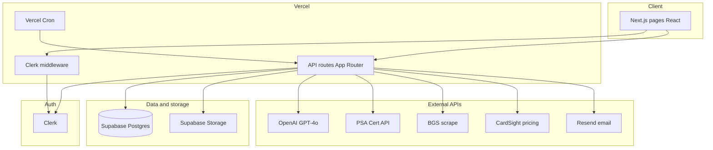

# Collectors Toolkit

**Live app:** [collectors-toolkit.vercel.app](https://collectors-toolkit.vercel.app) · **Product spec:** [`collectors_toolkit_product_spec.md`](collectors_toolkit_product_spec.md) · **PRD:** [`collectors_toolkit_PRD.md`](collectors_toolkit_PRD.md)

An AI-powered workbench for sports card collectors — identify graded slabs, estimate raw-card condition, manage a collection, import purchases, and track portfolio value. Built as a full-stack product (not a marketplace or price guide).

---

## Problem & audience

**Problem:** Collectors juggle disconnected tools for cert lookup, grading decisions, inventory, and purchase history. Manual entry is slow; bulk import barely exists elsewhere.

**Primary user:** A casual hobbyist (5–20 buys/month, 100+ cards) who wants fast answers — *what is this card?*, *should I grade it?*, *what do I own and what did I pay?* — without a subscription wall on core workflows.

**MVP success lens:** Frictionless capture (scan or import → review → collection) in under a minute per card, with human-in-the-loop safety on anything AI parses.

---

## Product highlights

| Area | What shipped | Product choice |
|------|----------------|----------------|
| **Graded scanner** | Photo → OCR cert → PSA / BGS / SGC lookup → save to collection | Cert APIs + vision OCR; rate-limited per user |
| **Raw AI grader** | 1–4 guided photos → PSA/BGS/CGC predictions + submission ROI | GPT-4o only (no third-party grader API); prominent “estimate only” disclaimer |
| **Collection** | Grid/list, detail edit, multi-photo gallery (≤10), cost basis & value | Statuses `owned` / `sold` / `traded` / `lost` — history preserved, not deleted |
| **Purchase import** | eBay screenshots, bookmarklet, Fanatics PDF, paste | **Always** user review before save; no auto-commit of parsed rows |
| **Portfolio** | Cost basis, current value, gain/loss, breakdowns | Manual value + CardSight market refresh (cron-capped) |
| **Want list & sets** | Targets, alerts plumbing, set completion % | V2: live comp alerts, public sharing |

**Differentiators vs. typical tools:** AI raw grading + multi-source purchase import + free-tier core flows in one product ([competitive context in PRD §3](collectors_toolkit_PRD.md)).

---

## System architecture

High-level request path: the browser talks only to **Next.js**; all data access uses the **Supabase service role** on the server after **Clerk** auth. User tables use **deny-all RLS** so the public anon key cannot read PII via PostgREST.



### Auth & data access

1. **Clerk** issues the session; middleware redirects unauthenticated users from protected routes.
2. API handlers call `auth()` → `getOrCreateUserId(clerkId, email)` → Supabase `users.id`.
3. **`createServiceClient()`** (service role) runs all queries, scoped by `users.id` in application code.
4. **RLS** on user-owned tables: `deny` for `anon` / `authenticated` (defense in depth). Catalog table `cards` is read-only public reference data.

### Core flows

**Scanner**

```
Photo upload → Storage → GPT-4o OCR cert → PSA/BGS/SGC lookup → graded_scans row → optional collection_cards
```

**Raw grader**

```
1–4 photos → Storage → GPT-4o Vision JSON grade → raw_grade_sessions → ROI / identify APIs → collection prefill
```

**Import**

```
Screenshot/PDF/paste/bookmarklet → GPT-4o parse → import_batches + import_items → user review UI → save to collection_cards
```

**Pricing (background)**

```
Vercel Cron → /api/pricing/cron → CardSight → price_snapshots + market cache → collection card market columns + sparkline observations
```

---

## Data model (conceptual)

Postgres schema is layered so card *identity* is shared and each user owns *instances*.

| Layer | Tables | Role |
|-------|--------|------|
| **Reference** | `cards` | Canonical card identity (player, year, set, parallel, …) |
| **Users** | `users` | Clerk sync (`clerk_id`, `email`) |
| **Instances** | `collection_cards`, `collection_card_images` | Owned cards, photos, purchase/value fields |
| **Activity** | `graded_scans`, `raw_grade_sessions`, `import_*`, `usage_logs` | Scanner, grader, import sessions |
| **Goals** | `want_list`, `want_list_price_alerts`, `card_sets`, `collection_set_progress` | Hunting list, set completion |
| **Market** | `price_*`, `cardsight_*`, `collection_card_market_observations` | CardSight cache, comps, price history |

Migrations live in [`supabase/migrations/`](supabase/migrations/) (`001`–`013`). See [AGENTS.md](AGENTS.md) for the full migration map and **RLS checklist** for new tables.

---

## Tech stack

| Layer | Choice |
|-------|--------|
| **App** | Next.js 15 (App Router), React 19, TypeScript |
| **UI** | Tailwind CSS, editorial design system ([`design/`](design/)) |
| **Auth** | Clerk |
| **Database & files** | Supabase (Postgres + Storage) |
| **AI** | OpenAI GPT-4o (vision: scanner OCR, grader, import parsing) |
| **Charts** | recharts (portfolio) |
| **Hosting** | Vercel (+ Cron for pricing & email alerts) |
| **Email** | Resend (want-list / digest alerts) |

---

## Features (routes)

| Module | Routes | Notes |
|--------|--------|-------|
| Graded scanner | `/scanner`, `/scanner/history` | Cert lookup, pop data, save to collection |
| Raw card grader | `/grader`, `/grader/history` | Multi-step photos, company predictions, ROI |
| Collection | `/collection`, `/collection/add`, `/collection/[id]` | Gallery ≤10 images, inline edit, market panel |
| Purchase import | `/import`, `/import/[batchId]` | Bookmarklet, screenshots, Fanatics PDF, paste |
| Want list | `/wantlist` | Target price, alert events (email when configured) |
| Portfolio | `/portfolio` | Value dashboard, cost basis vs. market |
| Set tracker | `/sets`, `/sets/[setId]` | Completion progress |

---

## API surface (server)

All routes under `src/app/api/` — Node.js runtime, Clerk auth, service-role Supabase. Representative groups:

| Group | Examples |
|-------|----------|
| Scanner | `POST /api/scanner/scan`, `GET /api/scanner/quota` |
| Grader | `POST /api/grader/grade`, `POST /api/grader/identify`, `GET /api/grader/roi` |
| Collection | `GET/POST /api/collection`, `GET/PATCH /api/collection/[id]`, `POST /api/collection/image` |
| Import | `POST /api/import/parse`, `GET /api/import/[batchId]`, `POST .../save`, `GET /api/bookmarklet` |
| Portfolio & sets | `GET /api/portfolio`, `GET/POST /api/sets`, `PATCH /api/sets/[setId]/progress` |
| Pricing | `GET /api/pricing/[collectionCardId]`, `POST /api/pricing/refresh`, cron `GET /api/pricing/cron` |
| Alerts | `GET /api/alerts/cron`, `GET /api/alerts/digest-cron` (Vercel Cron + secrets) |

---

## Project structure

```
src/
├── app/                 # Pages + API routes (App Router)
│   ├── api/             # REST handlers
│   ├── collection/      # Collection UI
│   ├── grader/          # Raw grader + history
│   ├── scanner/         # Slab scanner + history
│   ├── import/          # Import review flow
│   ├── portfolio/       # Portfolio dashboard
│   ├── sets/            # Set tracker
│   └── wantlist/
├── components/          # Shared UI (site-shell, Slab, editorial atoms)
└── lib/                 # Business logic (scanner, grader, collection, import, pricing, …)
tests/                   # node:test unit tests (139 tests)
supabase/migrations/     # Ordered SQL (001–013)
design/                  # Design system handoff + prototypes
docs/                    # Operational guides (e.g. alerts setup)
```

**For AI-assisted development:** [`AGENTS.md`](AGENTS.md) — conventions, security, module map.

---

## Security

- **Clerk** protects app routes; APIs require `auth()` and scope by Supabase `users.id` (not Clerk id).
- **Service role** is server-only; never expose `SUPABASE_SECRET_KEY` to the client.
- **RLS:** Deny-all policies on user tables for `anon` / `authenticated`; app uses service role. Catalog `cards` is intentionally read-only public.
- **Import:** Parsed rows never auto-save; bookmarklet and upload paths are validated in tests (`tests/import-security.test.ts`).
- **Cron / alerts:** `CRON_SECRET`, `PRICING_CRON_SECRET` guard scheduled routes.

After schema changes, rerun [Supabase Security Advisor](https://supabase.com/docs/guides/database/database-advisors) (or MCP `get_advisors`).

---

## Getting started

### Prerequisites

- Node.js 20+
- [Supabase](https://supabase.com) project
- [Clerk](https://clerk.com) application
- OpenAI API key
- PSA API token (recommended for cert lookup)
- CardSight API key (optional, for market pricing)
- Resend (optional, for email alerts)

### Setup

```bash
git clone https://github.com/akothar0/collectors-toolkit.git
cd collectors-toolkit
npm install
cp .env.example .env.local
# Fill in Clerk, Supabase, OpenAI, and other keys (see table below)
```

Apply database migrations:

```bash
npx supabase db push
# Or run SQL files in supabase/migrations/ in order (001–013)
```

| Migration | Purpose |
|-----------|---------|
| `001_initial_schema.sql` | Core schema (cards, users, collection, scans, import, sets) |
| `002_grader_columns.sql` | Grader session columns |
| `003_import_storage.sql` | Private `import-files` bucket |
| `004_rls.sql` | Deny-all RLS on user tables |
| `005_card_images_storage.sql` | Public `card-images` bucket |
| `006_collection_card_images.sql` | Photo gallery + backfill |
| `007_rls_sets.sql` | RLS for set tracker |
| `008_cardsight_pricing.sql` | Pricing tables + collection market columns |
| `009_rls_pricing.sql` | Deny-all RLS on pricing tables |
| `010_cardsight_market_cache.sql` | Global market cache |
| `011_cardsight_grade_map.sql` | Grade UUID map |
| `012_rls_market_cache.sql` | RLS on cache tables |
| `013_price_history_alerts.sql` | Market observations + want-list alerts |

Run locally:

```bash
npm run dev
```

Open [http://localhost:3000](http://localhost:3000).

---

## Environment variables

See [`.env.example`](.env.example).

| Variable | Purpose |
|----------|---------|
| `NEXT_PUBLIC_CLERK_PUBLISHABLE_KEY` | Clerk browser key |
| `CLERK_SECRET_KEY` | Clerk server key |
| `NEXT_PUBLIC_SUPABASE_URL` | Supabase project URL |
| `NEXT_PUBLIC_SUPABASE_PUBLISHABLE_KEY` | Supabase anon/publishable key |
| `SUPABASE_SECRET_KEY` | Service role key (**server only**) |
| `OPENAI_API_KEY` | Vision + grading + import parsing |
| `PSA_API_TOKEN` | PSA cert API |
| `CARDGRADE_API_TOKEN` | Optional cert fallback (not used for raw grading) |
| `CARDSIGHTAI_API_KEY` | CardSight market pricing |
| `PRICING_CRON_SECRET` / `CRON_SECRET` | Protect cron API routes |
| `RESEND_API_KEY` / `RESEND_FROM_EMAIL` | Want-list & digest email |
| `NEXT_PUBLIC_APP_URL` | Production URL (bookmarklet + email links) |

---

## Deployment (Vercel)

1. Import the GitHub repo in Vercel.
2. Set all variables from `.env.example` (use production Clerk + Supabase projects).
3. Apply migrations `001`–`013` to production Supabase.
4. Deploy; confirm crons in [`vercel.json`](vercel.json) (pricing weekly, alerts daily/weekly).

**Smoke test:** sign up → scan slab → grade raw card → add to collection → upload gallery → import batch → portfolio → want list → set progress.

---

## Scripts & quality

```bash
npm run dev      # development server
npm run build    # production build
npm run start    # production server
npm run lint     # ESLint (zero warnings)
npm run test     # 139 unit tests (node:test)
```

---

## Roadmap

Shipped MVP is documented in [`collectors_toolkit_product_spec.md`](collectors_toolkit_product_spec.md) (Weeks 1–8). Planned V2 includes live comps, want-list price alerts at scale, QR cross-device capture, TCG support, and collection sharing.

---

## Documentation index

| Doc | Audience |
|-----|----------|
| [`README.md`](README.md) | Overview, architecture, setup (this file) |
| [`collectors_toolkit_product_spec.md`](collectors_toolkit_product_spec.md) | Product vision, features, roadmap |
| [`collectors_toolkit_PRD.md`](collectors_toolkit_PRD.md) | Requirements, user stories, acceptance criteria |
| [`AGENTS.md`](AGENTS.md) | Engineering conventions for AI agents |
| [`docs/price-history-alerts-setup.md`](docs/price-history-alerts-setup.md) | Alerts & Resend setup |
| [`docs/live-pricing-spec.md`](docs/live-pricing-spec.md) | CardSight pricing behavior |

---

## License

Portfolio / demonstration project — see repository owner for use terms.
